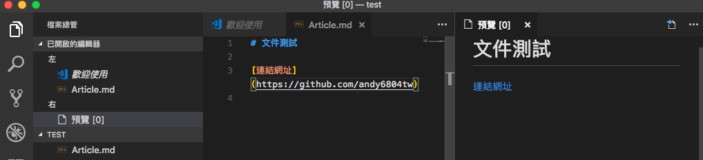
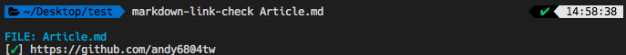
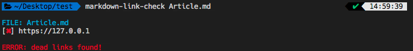
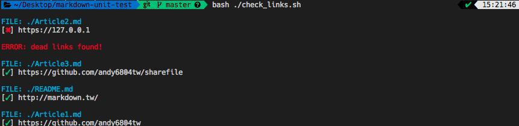
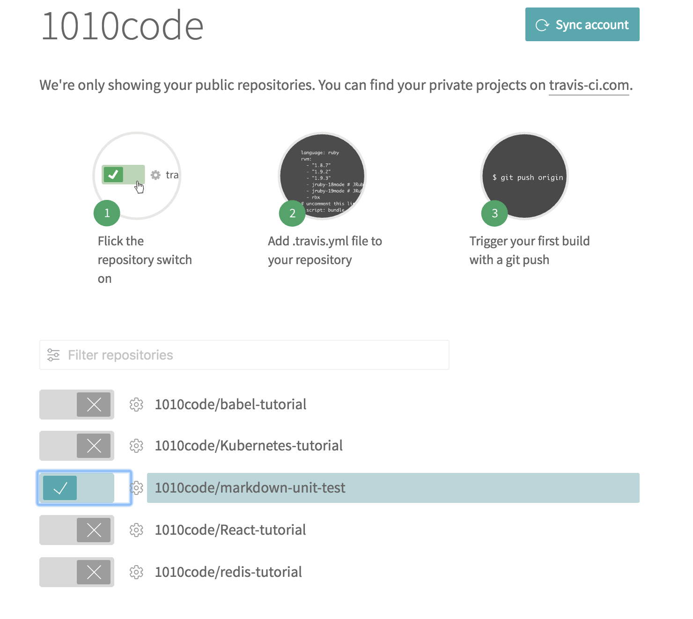
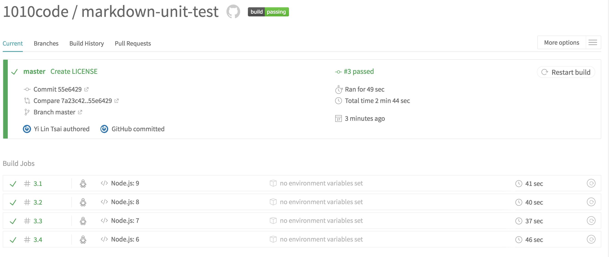

[](https://travis-ci.org/1010code/markdown-unit-test)
[](https://github.com/1010code/markdown-unit-test/blob/master/LICENSE)
# Markdown 文件也能做單元測試？
單元測試對開發者來說在也平常也不過了，透過單元測試能夠快速的了解專案的健康狀態，此篇要講的是關於 `Markdown` 的單元測試，什麼！文件要怎麼做測試？可以的當你文章量多每一篇的連結(URL)可能隨時間增長而失效，你總不可能每次在每篇一一的去打開測試吧？一般來說是等到看這篇文章的讀者發現連結失效在反映給作者，但導入單元測試後直接交給電腦檢查就好啦！

## 教學
### 安裝 `markdown-link-check`
使用 npm 安裝 `markdown-link-check` 套件，此套件能夠在終端環境下依序檢查每份檔案內的連結網址是否正常連線，若失效則會跑出警告訊息。

```bash
npm install -g markdown-link-check
```

> 若無法成功安裝朋友請在前面加上 `sudo` 使用管理者權限安裝

### 撰寫 Markdown 文件
安裝好檢查工具後在測試前我嫩先來寫篇 Markdown 格式的文件吧！若還不熟悉與語法的可以參考以下連結。

- [Markdown 語法說明](http://markdown.tw/)



### 測試文件
測試方式很簡單還記得我們先前安裝過 `markdown-link-check` 的 npm 全域嗎？這邊直接輸入指令+檔名即可。


```bash
# markdown-link-check [檔名.md]
# ex:
markdown-link-check Article.md
```

若連結正常則會通過測試。



試著把連結改成無意義的(例如 localhost)你會發現跑出失敗訊息，代表你的文章內的網址失效啦～



## 進階教學
那當我文章內容很多時怎麼辦？我可以結合到 CI 平台嗎？可以都可以我接下來會教你如何撰寫 bash 腳本來執行檢查全部的 Markdown 文件以及透過 Travis-CI 做單元測試。

### 撰寫多個 Markdown 文件

這邊不用示範了吧～請各位多建立幾個 `.md` 檔案以利測試。

### 撰寫測試腳本
`res_code` 是變數， 1 代表文章有其中有連結失效，0 代表全部正常。

接著會進入迴圈來檢查每一篇文章的連結 `${markdown}` 類似 JavaScript 中的字串變數，指的是文章的檔名。

還記得 `res_code` 變數嗎？最後會有個 `exit` 代表執行結束，一般執行正常會回傳 0。

```bash
#!/bin/sh

res_code=0

# Check local markdown files in recursive
for markdown in `find . -name \*.md`
do
	markdown-link-check "${markdown}"
	if [ ${?} -ne 0 ]; then
		res_code=1
	fi
done

exit ${res_code}
```

建立好了可以先在本機測試此腳本指令是否正常。

```bash
bash ./check_links.sh
```



### 整合 Travis-CI
進入 [Travis-CI](https://travis-ci.org) 網站並連動你的帳戶，這邊使用 GitHub 作為示範，進入後就可以選擇你要測試的 Respiratory 進行連動。



### 撰寫 Travis-CI 描述檔
建立 `.travis.yml` 檔案，此檔案就是描述我們使用 Travis-CI 進行測試的腳本描述檔，其中包含測試版本、執行指令......等，所有動作都在這份檔案內完成。

```yml
language: node_js

node_js:
    - "9"
    - "8"
    - "7"
    - "6"

before_script:
    - "npm install -g markdown-link-check"

script:
    - "bash ./check_links.sh"

after_script:
    - "echo ${?}"
```

### push 到 GitHub
一切準備就緒後就把我們的專案 push 到 GitHub 上吧！我們先前有先跟 Travis-CI 做連動專案了，所以當有提交更新時 Travis-CI 會自動被出發而進行單元測試。

測試成功後會看到以下畫面：


## LICENSE
MIT
